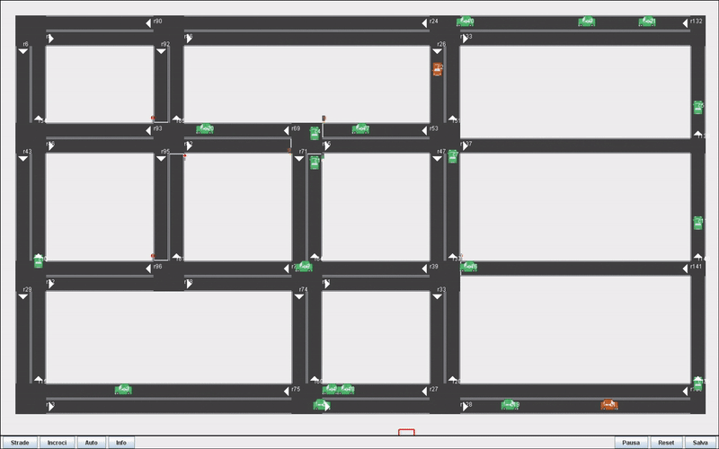
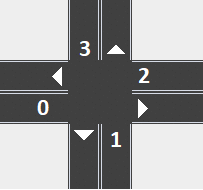

# Simulazione del traffico stradale

## Repository: [Icon2019](https://github.com/lokiuox/Icon2019)

### Gruppo: Giuseppe Nanna, Flavio Quatraro, Arcangelo Saracino, Savino Sisco  



### Intro 
Il sistema è una semplice simulazione di traffico stradale scritta in Java.

Ogni automobile nella simulazione è in grado di calcolare e di seguire percorsi verso la propria destinazione sottomettendo query ad una base di conoscenza definita in Prolog. Le automobili sono in grado di scambiare informazioni tra loro allo scopo di migliorare il percorso definito dal navigatore.

### Idea di base
Si immaginino le strade di una città percorse da automobilisti ognuno con una destinazione (assunta casuale). Ogni automobilista è interessato a seguire il percorso più veloce che viene calcolato con l’ausilio di un navigatore che conosce la topologia delle strade.

Alcuni automobilisti dispongono di un tipo diverso navigatore, in grado di calcolare percorsi tenendo anche conto di informazioni sul traffico. Ognuno di questi navigatori ottiene tali informazioni scambiandole con le automobili vicine che dispongono dello stesso navigatore.
Ovvero quando le auto si incrociano effettuano uno scambio di conoscenza (ritenuta valida attraverso un Time to Live).

### Scenario
La simulazione opera su uno scenario (classe `com.patterson.world.Scenario`) che definisce:
 + un insieme di strade (classe `com.patterson.entity.Road`)
 + un insieme di incroci tra strade (classe `com.patterson.entity.Intersection`)
 + un insieme di automobili (classe `com.patterson.entity.Car`)

Uno scenario può essere disegnato dall'utente sfruttando un apposito editor e serializzato sotto forma di file JSON. Insieme allo scenario viene creata automaticamente una base di conoscenza Prolog con clausole che descrivono lo scenario stesso.

### Car
Ogni automobile segue un percorso (`Car.path`) costituito da una sequenza di strade. Giunto alla fine di una strada (viene eseguito il metodo `Car.endRoad()`), l’automobile estrae la strada successiva da `Car.path` e la segue. Ogni automobile rileva la presenza di altre automobili nella stessa strada (con il metodo `Car.isNearCar()`) e rallenta, eventualmente fino a fermarsi del tutto, per evitare collisioni.

### Intersection
Giunta ad un incrocio, ogni macchina attende di ricevere da quest’ultimo il permesso di passare in base alle regole della precedenza e all'eventuale presenza di semafori e di stop.
Ogni incrocio determina se può essere o meno concesso il permesso di passare ad una determinata macchina “c1” interrogando la base di conoscenza con una query del tipo: `precedenza(c1).`

L’incrocio, prima di eseguire la query, asserisce nella base di conoscenza un certo insieme di fatti relativi alla posizione e al percorso delle automobili in prossimità dell’incrocio, nonché allo stato di eventuali semafori. Tali fatti asseriti, a differenza della topologia delle strade, sono accessibili esclusivamente al singolo incrocio e gestiti tramite la classe `com.patterson.utility.Knowledgebase`, che provvederà ad asserirli e ritrattarli opportunamente prima e dopo le query.

### INavigator
Quando un’automobile completa un percorso, sceglie casualmente una nuova strada come destinazione e calcola il percorso più veloce con una chiamata ai metodi dell’interfaccia `com.patterson.entity.INavigator`.
Si sono fornite più implementazioni per l’interfaccia `INavigator` associabili ad ogni automobile:
 + `NavigatorAStar`: implementazione basata su A*
 + `NavigatorProlog`: percorso definito in Prolog con il predicato `piubreve/3`
 + ? `NavigatorIDA*`: implementazione basata su IDA*

### Scambio di informazioni
Si è definita una sottoclasse di automobili in grado di scambiarsi informazioni (`com.patterson.entity.CarIE`). Quando due automobili di questo tipo si avvicinano ciascuna invia all'altra informazioni (codificate in Prolog) relative alle proprie posizioni e velocità correnti (raccolte ad intervalli di tempo regolari) insieme a tutte le altre informazioni ricevute in precedenza da altre macchine. Tali informazioni verranno usate per ridefinire in Prolog i pesi delle strade (usati dagli algoritmi di pathfinding) in modo da tener conto del traffico.

Ogni informazione scambiata è rappresentata come un “pacchetto” (classe `com.patterson.utility.Packet`, sottoclasse di `Knowledgebase`), ossia una piccola base di conoscenza alla quale è associato un TTL, ossia un intervallo di tempo oltre il quale è scartata.

Ogni automobile di classe `CarIE` gestisce un certo numero di “pacchetti” attraverso un oggetto CarIE.kb di classe `com.patterson.utility.KnowledgebaseIE` (sottoclasse di `Knowledgebase`). Come nel caso degli incroci, ogni automobile può accedere esclusivamente alle informazioni del proprio `CarIE.kb`. Le informazioni presenti in `CarIE.kb` e nei suoi pacchetti vengono opportunamente asserite e ritrattate prima e dopo ogni query, in modo da non essere visibili nelle query delle altre automobili.
# Implementazione in Prolog
Il programma di simulazione ricostruisce la struttura del grafo rappresentante le strade e gli incroci con annesse macchine,semafori,limiti stradali e stop mediante una loro rappresentazione sotto forma di base di conoscenza che viene dinamicamente interrogata per ricostruire lo stato e per aggiornarlo in circostanze come gli scambi di conoscenza.
Di seguito ne è rappresentata la struttura e le funzioni.

```
:-dynamic(strada_corrente/2).
:-dynamic(prossima_strada/2).
:-dynamic(partenza/2).
:-dynamic(destinazione/2).
:-dynamic(mitrovo/3).
:-dynamic(rosso/1).
:-dynamic(peso/2).
:-dynamic(contamacchine/2).
:-dynamic(velocita/3).
:-dynamic(somma/2).
:-dynamic(conta/2).
```

Definizione di tutti i predicati come dynamic per consentire di effettuare nuove asserzioni, aggiornando la conoscenza mediante comando assert(), durante l’esecuzione del programma di simulazione e del relativo interprete.
La porzione commentata fa riferimento ad eventuali predicati da inserire come espansione della base di conoscenza.

```
partenza(partenza,partenza1).
destinazione(destinazione,destinazione1).
angolo(angolo,angolo1).
collega(incrocio1,strada,incrocio2).
coordinata(strada33,x,y).
prossima_strada(macchina4,strada6).
strada_corrente(macchina5,strada7).
lunghezza(lunghezza1,lunghezza2).
velocitamax(strada3,numero1).
semaforo(strada5).
stop(strada4).
velocita(macchina3,velocitas,stradas).
strada(strada6).
incrocio(incrocio3).
macchina(macchinas).
velocitamedia(strada3,qualcosa).
```

Elenco di asserzioni di esempio,una per ogni predicato.

```
strada(X):- lunghezza(X,_Y).
strada(X):- angolo(X,_Z).
strada(D):- collega(_C,D,_E).
strada(X):- peso(X,_Y).
strada(L):- coordinata(L,_X,_Y).
strada(L):- strada_corrente(_K,L).
strada(L):- velocita(_S,_E,L).

incrocio(C):- collega(C,_D,_E).
incrocio(E):- collega(_C,_D,E).

macchina(K):- strada_corrente(K,_L).
macchina(S):- velocita(S,_E,_L).
```

Definizione delle conseguenze logiche di ogni predicato,ovvero viene specificato per ogni argomento quale predicato ne consegue.
Le parti commentate fungono da eventuali miglioramenti futuri.

```
somma([],0).
somma([X|Y],D):- somma(Y,G),velocita(X,F,_L),D is F + G.
```
Il predicato somma calcola ricorsivamente la somma(argomento D) delle velocità delle macchine contenute nella lista (argomento [X|Y]).
```
conta([],0).
conta([_H|Coda], N) :- conta(Coda, N1),N is N1 + 1.
```
Il predicato conta calcola ricorsivamente il numero di elementi di una lista.
```
contamacchine(L,N):- findall(X,strada_corrente(X,L),Y),conta(Y,N).
```
Il predicato contamacchine trova mediante findall la lista di macchine nella strada considerata e ne conta il numero
```
velocitamedia(L,D):- findall(X,strada_corrente(X,L),Y),
                     contamacchine(L,N),somma(Y,C),D is /(C,N).
```
Il predicato velocitamedia calcola la media aritmetica delle velocita delle macchine nella strada considerata.
```
peso(L,X):- 
	lunghezza(L,K),
	contamacchine(L,N), 
	(semaforo(L) -> J is 5; J is 0),
	(N is 0 -> D is 1,W is 0 ; velocitamedia(L,D), W is 1),
	(stop(L) -> Costante is 3 ; Costante is 0),
	velocitamax(L,F),
	X is +(+(+(/(K,F),/(J,2)),Costante),*(/(K,D),W)).
```
Il predicato peso effettua il calcolo del peso associato alla strada secondo la formula:
```
peso=(lunghezza/velocita_massima)+
     (lunghezza/velocita_media)+
     costante_stop+
     attesa_rosso
```

Ogni singolo fattore viene considerato solo se c’è relativo riscontro nella rappresentazione del grafo mediante il costrutto if then else.

## Regole di precedenza


Nell’incrocio rappresentato,ogni vettura deve domandarsi se occorre dare la precedenza ad ognuna delle altre, considerando sia la sua posizione corrente che la strada verso cui intende dirigersi. Tale criterio è rappresentato dalle porzioni evidenziate in giallo alla destra di ogni automobile.
Il programma di simulazione,nel dover gestire un incrocio dunque domanderà alla base di conoscenza se la macchina A abbia la precedenza verificando che non debba darla a nessun’altra macchina dell’incrocio e verificando che la macchina considerata non si trovi ad un semaforo rosso.In base alle risposte ricevute determinerà l’ordine di precedenza che gestisce l’incrocio.
```
precedenza(A) :- \+(precedenza(A,_B)),strada_corrente(A,L),\+(rosso(L)).
```
Per determinare se la macchina A debba dare precedenza alla macchina B occorrerà dunque considerare la prossima strada di A e la strada corrente di entrambe,così da poterne confrontare gli angoli associati per determinare quella che nella figura è la destra,evidenziata in giallo, della macchina A.



Ulteriori controlli sono necessari nel caso in cui la strada dI B abbia un semaforo rosso o ci sia uno stop poichè in quel caso A non deve dare precedenza.
Infine è necessario verificare se A stesso si trovi ad uno stop o ad un semaforo rosso per determinare,a seconda dello stato di B, se occorre dare precedenza o meno.
```
precedenza(A,B) :-
	prossima_strada(A,Rn),
	strada_corrente(A,Ra),
	strada_corrente(B,Rb),
	((stop(Ra), \+(stop(Rb))-> true;fail) ; 
         (rosso(Ra), \+(rosso(Rb))-> true;fail) ;
         (\+(stop(Ra)),\+(rosso(Ra))->true;fail)),
	\+(A=B),
	(rosso(Rb)-> fail;true),
	(stop(Rb)-> fail;true),
	angolo(Rn, An),
	angolo(Ra, Aa),
	angolo(Rb, Ab),
	(1 is -(Aa,An) -> fail; 
	( (0 is -(Aa,An), -1 is -(An,Ab)) -> true; 
	(-1 is -(Aa,An),(0 is -(An,Ab) ; -1 is -(An,Ab))) -> true ;
	((-2 is -(Aa,An),
	(1 is -(An,Ab) ; 0 is -(An,Ab) ; -1 is -(An,Ab))) -> true ;
	fail))).
```
Calcolo del percorso minimo
Il calcolo del percorso minimo viene effettuato innanzitutto realizzando un predicato in grado di garantire la costruzione di un percorso sotto forma di lista

```
percorso(A,B,Path,Len) :-
       spostamento(A,B,[A],Q,Len), 
       reverse(Q,Path).
```

Il predicato percorso dunque costruisce una lista Path di lunghezza complessiva Len ottenuta facendo la lista inversa di quella ottenuta dal predicato applicato ricorsivamente  spostamento che:

```
spostamento(A,B,P,[B|P],L) :- 
       collega(A,C,B),
	   peso(C,L).
```

Nel caso semplice o passo base verifica che A e B,incroci, siano collegati mediante una strada C di peso L. Tale incrocio B viene così aggiunto in testa alla lista dei nodi P già considerati.
```
spostamento(A,B,Visitato,Path,L) :-
		collega(A,D,C),
		peso(D,F),
		C \== B,
		\+member(C,Visitato),
		spostamento(C,B,[C|Visitato],Path,L1),
		L is F+L1.  
```
Nel passo ricorsivo,invece viene verificato che B sia differente da C,nodo collegato ad A, e che C non sia già stato visitato (eseguendo dunque una potatura dei cicli) , e si procede dunque ad aggiungerne il valore F del peso al peso complessivo L e ha ricalcolare lo spostamento da C a B aggiungendo C alla lista dei Visitati. Una volta giunti al passo base la lista dei Visitato sarà ripresa da Path che ci aggiungerà l’ultimo elemento e verrà restituita come lista finale del percorso.
```
piubreve(A,B,Path,Length) :-
   setof([P,L],percorso(A,B,P,L),Set),
   Set = [_|_],
   minimo(Set,[Path,Length]).
```
Il predicato piubreve crea un insieme di liste formate da ogni percorso P con relativa lunghezza L e di questi stabilisce il percorso con lunghezza minima.
```
minimo([F|R],M) :- min(R,F,M).
```
Il predicato minimo prende il primo elemento F di Set e mediante il predicato min lo confronta ricorsivamente con il resto di Set  R per stabilire quale il termine minimo M. 
```
min([],M,M).
```
Passo base che restituisce M se il resto della lista di Set è vuota.

```
min([[P,L]|R],[_,M],Min) :- L < M, !, min(R,[P,L],Min). 
min([_|R],M,Min) :- min(R,M,Min).
```
Passo ricorsivo: se L è minore di M allora calcolo min tra il [P,L] e il resto della lista R altrimenti esegue la seconda regole sottostante e non considero l’elemento di che precede R e continua calcolare min direttamente da R risparmiando in termini di computazione.
# KnowledgeBase
La KB (`resources/KB_final.pl`) scritta in prolog è interrogata attraverso la libreria swi-prolog la quale ci permette di eseguire le query all'interno di java. Questa classe (`com.patterson.KnowledgeBase`) è l'unico punto di comunicazione con la KB.

La classe KnowledgeBase si occupa appunto di effettuare la query all'interno della KB consultata e interpretare i risultati sia per rispote booleane che per dati (stringhe e numeri). Le query possono essere scritte come nell'inteprete o attraverso classi opportune che definiscono atomi o variabili.

Questa classe risulta di elevata importanza dato l'utilizzo massiccio fatto da parte della classe NavigatorUtility, capace di recuperare e organizzare le informazioni acquisite dalla KB e passarle al Navigator a riguardo strade ed incroci.
Anche la classe Car utilizza questa classe per informare la KB della posizione dell'auto dopo lo spostamento effettuato.

Si è fatto utilizzo anche dei metodi di asserzione ed eliminazione di fatti per rendere la KB dinamica.
Per sfruttare la dinamicità del programma è stato necessario definire le procedure in maniera dinamica.

# Navigator
L'implementazione di A* è utilizzata dal navigator elemento fondamentale per guidare l'auto all'interno del mondo.

Si è pensato di sviluppare due tipologie di navigatori, con e senza scambio di conoscenza fra le auto.
Ovvero in quello con scambio di conoscenza una macchina informa tutte le altre dove si trova attraverso un asserzione sulla KB, questo determinerà un cambiamento del peso della strada. Il navigatore ogni volta che arriverà ad un incrocio cercherà il nuovo percorso migliore, perchè questo aggiornamento dei pesi potrebbe determinare un cambio di percorso.
Mentre nel navigatore senza scambio di conoscenza si calcolerà il percorso una sola volta e non si utilizzeranno i dati in tempo reale condivisi dalle altre auto.

Una macchina (Classe Car) quando viene inizializzata all'interno contiene un Navigator, il navigator crea il grafo come spiegato in A* ed è utilizzabile dall'auto per produrre il primo percorso. 
È compito della macchina informare la KB del raggiungimento di un incrocio e quindi interrogare nuovamente il Navigator il quale aggiorna i pesi dei vertici e ricalcola dal nuovo punto di partenza il percorso per la meta.

# A*
L'algoritmo **A*** (`com.patterson.algorithms.AStarGraph`)combina gli algoritmi di ricerca su grafo LCF e BFS, dove per ogni percorso p considera la stima f(p) del suo costo totale (dal nodo di partenza fino al goal), con f(p) = cost(p) + h(p).
Dove h(p) è una stima del costo minimale dall’ultimo nodo di p fino a un goal.

Si è pensato di utilizzare **A*** perchè i fattori di ammissibilità sono rispettati ovvero:
- il fattore di ramificazione è finito
- costi archi > 0 
- h(n) è ammissibile 


**Classe di riferimento:** AStarGraph

**Classe correlata:** Graph

Per applicare A* si è pensato di creare un grafo come struttura dati, dove i nodi sono le strade e gli archi gli incroci (strada a strada) ed i vertici hanno come proprietà il peso del nodo, anche gli archi riportano il peso del nodo utile nel calcolo del percorso.

Per la costruzione del grafo, in particolare i vertici, si interroga la KB e si costruiscono le strade con le proprietà (nome,lunghezza,peso,x,y).

Per la costruzione del grafo, in particolare gli archi, si interroga la KB e si costruiscono gli incroci attraverso la procedura collega che determina il collegamento di due incroci attraverso una strada.

Per la creazione del grafo ci si è assicurati di evitare ambiguità con doppioni utilizzando un insieme. 

Per la funzione di costo di A* si somma il peso (funzione implementata in prolog) di ogni arco attraversato e la funzione euristica data dalla norma uno delle coordinate dei punti di arrivo e destinazione.

Il MPP (Multipath pruning) permette di evitare i cicli. 
Si è applicato il MPP, attraverso due insiemi, uno dei nodi attraversati ed uno con il percorso scelto. 
Questo permette di visitare un nodo, trovare i nodi adiacenti e scegliere tra tutti i nodi disponibili il prossimo da percorrere.


